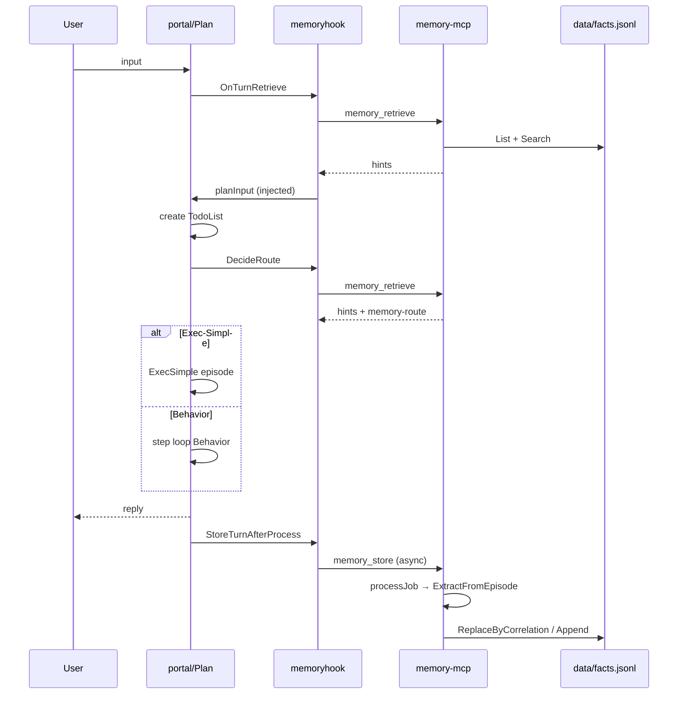

# AgentTestMemoryMCP — 当前实现架构说明（As-Is）

> **文档用途**：描述**当前已落地代码**（As-Is），供评审与排障。  
> **快照日期**：2026-05-24  
> **实现阶段**：**Phase-2d**（`phase=2d-factworld`）— 图检索 + LLM Store + 退化/对齐  
> **宪法**：`DESIGN_INTENT.md`  
> **批准落地路径**：`MEMORY_AGENT_IMPLEMENTATION_PLAN.md`（2b～2d **已完成**；2e **暂缓**）  
> **进度**：`IMPLEMENTATION_PROGRESS.md`  
> **差距登记**：`ARCHITECTURE_DRIFT.md`

---

## 1. 系统定位

| 项 | 说明 |
|----|------|
| **项目** | `AgentTestMemoryMCP` — 独立 MCP Server 工程（Go） |
| **角色** | 跨 Host 可复用的**第三层长效事实记忆**（Fact World 雏形） |
| **主 Host** | `AgentTest`（Plan 编排 + Behavior / Exec-Simple 执行） |
| **不是什么** | 会话滑动窗口（第一层在 Host）；不是 Plan/Behavior 的执行工具 |

**协议铁律（已实现）**

- 对外仅两个 MCP 工具：`memory_store`、`memory_retrieve`
- 入参/出参均为 **JSON 字符串**（TextContent），无 Host 专有 required 字段
- **禁止**对 Host 暴露建图/删节点/改图类工具
- 执行 Agent（Behavior / Exec-Simple）**不**在 `capabilities.attach_to` 中挂载本 MCP

---

## 2. 部署与进程模型

```text
┌─────────────────────────────────────────────────────────────────┐
│ AgentTest 主进程                                                 │
│  InitAgents → plan/memoryhook.InitFromConfig                     │
│  子进程: memory-mcp.exe -engine factworld  (stdio JSON-RPC)      │
│       │                                                          │
│       ├─ MCP: memory_store / memory_retrieve  ← Host 钩子唯一入口 │
│       └─ 伴生 HTTP: :8091/console/  (MCP 自闭环，Host 无配置)    │
└─────────────────────────────────────────────────────────────────┘
```

| 启动方式 | 命令/场景 | MCP | 控制台 |
|----------|-----------|-----|--------|
| **生产默认** | Host `mcp_command` 拉起 | stdio | 自动伴生 `127.0.0.1:8091`（可 `MEMORY_MCP_CONSOLE_DISABLE=1` 关闭） |
| 仅控制台 | `-console 127.0.0.1:8091` | 无 | HTTP |
| MCP + 控制台同端口 | `-http 127.0.0.1:8090` | Streamable HTTP | `/console/` |
| 占位/测试 | `-engine stub` / `test` | stdio | 同左 |

**环境变量（常用）**

| 变量 | 作用 |
|------|------|
| `MEMORY_MCP_DATA_DIR` | 数据根目录（facts、episodes、jobs） |
| `MEMORY_MCP_ENGINE` | `factworld`（默认）\| `stub` \| `test` |
| `MEMORY_MCP_CONSOLE_LISTEN` | stdio 伴生控制台地址，默认 `127.0.0.1:8091` |
| `MEMORY_MCP_CONSOLE_DISABLE` | `1` 关闭伴生控制台 |

---

## 3. 对外 MCP 工具契约

### 3.1 `memory_store`

| 参数 | 类型 | 说明 |
|------|------|------|
| `content` | string，必填 | 单条 episode 原始文本（Host 序列化的整轮需求日志） |
| `source` | string，可选 | 如 `agenttest-plan` |
| `kind` | string，可选 | 如 `episode` |
| `correlation_id` | string，可选 | Host 关联 ID，如 `turn_id` |

**返回（JSON 字符串）**：`accepted`、`job_id`、`skipped`、`skip_reason`、`message`、`phase`

**SLA**：同步 ACK；事实抽取 **异步**（goroutine）。

### 3.2 `memory_retrieve`

| 参数 | 类型 | 说明 |
|------|------|------|
| `context` | string，必填 | 本轮完整上下文字符串 |
| `query_hint` | string，可选 | 补充检索意图，不能替代 context |

**返回（JSON 字符串）**：`hints`（裁切后的参考文本）、`skipped`、`skip_reason`、`phase`

**SLA**：同步；失败或空库时 **不阻断** Host（降级为空/占位 hints）。

---

## 4. MCP 内部架构（factworld 引擎）

```text
cmd/memory-mcp/main.go
    │
    ├── registerTools → engine.Engine
    │       ├── Store  ──► filter → episode 落盘 → job 队列 → 异步 processJob
    │       └── Retrieve ──► filter → facts.List → Search → BuildHints
    │
    └── console.Server（只读，与 Engine 共享 dataDir）
            ├── GET /console/api/graph|search|stats
            └── 静态页 3D 力导向图（three.js + 3d-force-graph）
```

### 4.1 模块职责

| 包路径 | 职责 |
|--------|------|
| `internal/engine` | `Engine` 接口；`FactWorldEngine`（默认）、`StubEngine`、`TestEngine` |
| `internal/agent/rules.go` | **规则抽取**（无 LLM）：episode → 0~1 条 `Fact` |
| `internal/facts` | `facts.jsonl` 追加/列表/按 correlation 替换 |
| `internal/filter` | store/retrieve 寒暄、空输入等零 LLM 过滤 |
| `internal/retrieve` | 关键词打分、`BuildHints`、`---memory-route---` JSON 块 |
| `internal/response` | 统一 JSON 字符串响应 |
| `internal/textutil` | 分词/匹配辅助 |
| `internal/console` | 开发用 HTTP API + 嵌入前端；图由 facts **推导**，非持久图库 |

### 4.2 Store 流水线（异步）

```text
memory_store
  → ShouldSkipStore (filter)
  → writeEpisode
       data/episodes/YYYY-MM-DD/{jobID}.md
       data/store_log/store_{timestamp}.md
  → enqueueJob → data/jobs/pending/{jobID}.json
  → 同步返回 accepted=true
  → [goroutine] processJob
       → agent.ExtractFromEpisode (规则)
       → 若 correlation_id 非空: ReplaceByCorrelation
       → 否则 Append 到 facts.jsonl
       → job → jobs/done | jobs/dead
```

**规则抽取要点**（`ExtractFromEpisode`）

- 解析 Markdown 段：`## 用户诉求`、`## 门户回复`、`## 计划终态 (TodoList)`
- 从 plan 块解析 `status`、`tools_called`、`artifacts`
- 生成单条 `Fact`：`text`（历史需求摘要）、`tags`（硬编码关键词表）、`tools`、`outcome`、`confidence`
- **每 episode 通常 1 条 fact**（未拆分多条）

### 4.3 Retrieve 流水线（同步）

```text
memory_retrieve
  → ShouldSkipRetrieve (filter)
  → facts.Repo.List() 全量读 jsonl
  → retrieve.Search: 对每条 fact 算 MatchScore(context, queryHint)
       topK=5, minScore=0.35, 过滤 weight<0.1
  → retrieve.BuildHints
       组装 【跨会话事实参考】+ 推荐经验 + 其它相关
       附加 ---memory-route--- JSON:
         exec_simple_match: yes|no
         confidence, fact_ids
       判定: top score >= routeThreshold(0.75) 且 outcome 为 success/completed
  → 返回 JSON { hints: "..." }
```

**无**：向量索引、图遍历、LLM、retrieve 硬超时（依赖调用快慢）。

---

## 5. 数据模型与存储

### 5.1 Fact（`internal/facts/fact.go`）

```go
ID, EpisodeID, Source, CorrelationID
Text, Tags[], Outcome, Tools[], Artifacts[]
TierHint, Confidence, Weight, CreatedAt
```

持久化：`{DATA_DIR}/facts/facts.jsonl`（一行一 JSON）。

### 5.2 目录布局

```text
data/
  facts/facts.jsonl          # 检索主库
  episodes/YYYY-MM-DD/       # 原始 episode
  store_log/                 # store 审计副本
  jobs/pending|done|dead/    # 异步任务状态
```

### 5.3 图结构

- **宪法目标**：持久节点/边，Memory Agent 维护
- **当前实现**：**无**独立图库；开发控制台从 facts 字段 **临时推导** Tag/Episode/Tool 边用于 3D 展示

---

## 6. Host（AgentTest）集成

### 6.1 配置（`config/app.yaml`）

```yaml
plan_memory_hook:
  enabled: true
  provider: mcp
  store_enabled: true
  mcp_command: ".../memory-mcp.exe"
  mcp_engine: factworld
  mcp_env:
    MEMORY_MCP_DATA_DIR: ".../data"

executor:
  exec_simple_enabled: true
  exec_simple_min_confidence: 0.75
  exec_simple_max_tier: 2
```

**说明**：Host **不**配置控制台；控制台由 MCP stdio 进程伴生启动。

### 6.2 钩子与入口

| 钩子 | 代码位置 | 时机 | 行为 |
|------|----------|------|------|
| **OnTurnRetrieve** | `portal/gateway.go` → `RetrieveTurnBeforeProcess` | `PlanAgent.Process` **之前** | `memory_retrieve`；`InjectTurnHints` 拼到用户输入前 |
| **OnTurnStore** | `portal/gateway.go` → `StoreTurnAfterProcess` | `Process` **之后**（异步） | `BuildEpisodeContent` → `memory_store` |
| **DecideRoute** | `planAgent.go` → `memoryhook.DecideRoute` | Plan **拆步后** | 第二次 `memory_retrieve`；决定是否 Exec-Simple |

### 6.3 Episode 内容（Host 组装）

`BuildEpisodeContent` 包含：

- `[source=agenttest-plan turn=… plan=…]`
- `## 用户诉求` — **原始**用户 input（非注入 hints 后文本）
- `## 门户回复` — 去掉页脚编排元数据
- `## 计划终态 (TodoList)` — 格式化步骤 + 可选完整 document JSON（<12KB）

store 参数：`source=agenttest-plan`，`kind=episode`，`correlation_id=turn_id`。

### 6.4 一轮用户交互的 retrieve 次数

| 次序 | 调用方 | context 主要内容 | 用途 |
|------|--------|------------------|------|
| 1 | OnTurn | 用户本轮原话 | Plan 拆步参考（hints 注入） |
| 2 | DecideRoute | Plan.UserRequirement + 摘要/状态 | **Exec-Simple 路由**（以此次为准） |

### 6.5 Exec-Simple 路由条件（Host 侧护栏）

全部满足才 `UseSimple=true`：

1. `plan_memory_hook.enabled` && `exec_simple_enabled` && ExecSimpleAgent 已注册  
2. `max(step.tier) <= exec_simple_max_tier`（默认 2）  
3. `memory_retrieve` 解析 `matched=true` 且 `confidence >= exec_simple_min_confidence`（默认 0.75）  

**注意**：有 MCP、有 store，**不必然**走 Exec-Simple；须第二次 retrieve 命中。

### 6.6 Exec-Simple 执行形态

- Plan 生成 `execution_mode: simple` 的 TodoList  
- **单 episode** 调用 `ExecSimpleAgent` 完成多步 MCP（非逐步 Behavior）  
- 后续 step 在 TodoList 中常为 `skipped`（episode 已整体完成）  
- 失败时：阻塞 simple 文档 → 新建保守 TodoList → 逐步 Behavior（**pitfall store 未实现**）

---

## 7. 开发控制台（MCP 内置）

| 项 | 说明 |
|----|------|
| URL | `http://127.0.0.1:8091/console/`（stdio 伴生默认） |
| 能力 | 3D 力导向拓扑、搜索栏、节点详情、只读 |
| API | `/console/api/graph`、`/search`、`/stats` |
| 数据源 | 读取 `facts.jsonl`，边为 **推导**（has_tag、used_tool、similar 等） |
| 与业务关系 | **不参与** store/retrieve 逻辑；仅供开发校验 |

---

## 8. 端到端数据流（简图）



---

## 9. 与宪法 / 批准方案的距离

> 完整漂移表见 `ARCHITECTURE_DRIFT.md`。专家评审 **Q4–Q6 已结案**；**2b～2d 已对齐宪法**。

| 能力 | 当前 (2d) | 备注 |
|------|-----------|------|
| 持久图 + Weighted BFS retrieve | ✅ `edges.jsonl` + BFS + 出度惩罚 + 防环 | retrieve 加载持久边 |
| BM25×能级×weight 剪枝 | ✅ `retrieve/pipeline.go` | 默认 `RETRIEVE_PRUNE=bm25` |
| retrieve 预算 | ✅ `MEMORY_MCP_RETRIEVE_BUDGET_MS` | 超时降级 |
| Pitfall / 路由抑制 | ✅ | `exec_simple_match=no` |
| LLM 结构化抽取 + L1 Fuzzy | ✅ `memoryagent/*` | S5 失败回退 rules |
| supersede / embedding 对齐 | ✅ `degenerate` + `entity` + `align` | 异步对齐不阻塞 Store |
| 可选 retrieve LLM prune | ⏸ **暂缓** | 见 `IMPLEMENTATION_PROGRESS.md` §2e |
| Host 不挂载 MCP / 字符串协议 | ✅ | 保持 |
| 伴生 Console | ✅ | **P2**：仍由 facts 推导展示边，未直读 `edges.jsonl` |

---

## 10. 已知问题与体验债

1. **Plan document JSON** 内 `user_requirement` 可能含 OnTurn 注入的【跨会话事实参考】大块文本；`## 用户诉求` 段仍为干净文本。  
2. **`deriveTags` 硬编码**（WorkSpace、filesystem 等），跨场景扩展弱。  
3. **测试 seed fact** 长期影响 retrieve（如 boundary-test）。  
4. **同参工具去重**：Exec-Simple 新 episode 内可能跳过重复 `list_directory`。  
5. **Verification Gate L2** 在 Host 侧关闭，与记忆路由独立。  
6. **Console** 拓扑展示与 retrieve 用的 `edges.jsonl` 尚未完全同源（P2）。

---

## 11. 代码仓库与关键文件索引

**AgentTestMemoryMCP**

| 路径 | 说明 |
|------|------|
| `cmd/memory-mcp/main.go` | 入口、stdio/HTTP/console 模式 |
| `internal/engine/factworld.go` | Store/Retrieve 主逻辑 |
| `internal/agent/rules.go` | 规则抽 fact |
| `internal/retrieve/hints.go` | hints + memory-route |
| `internal/facts/repo.go` | jsonl 读写 |
| `internal/console/*` | 3D 开发台 |
| `docs/DESIGN_INTENT.md` | 宪法（目标态） |

**AgentTest（Host）**

| 路径 | 说明 |
|------|------|
| `plan/memoryhook/mcp_provider.go` | stdio MCP 客户端 |
| `plan/memoryhook/memory_mcp_hook.go` | DecideRoute |
| `plan/memoryhook/turn_store.go` | OnTurnStore |
| `plan/memoryhook/turn_retrieve.go` | OnTurnRetrieve |
| `agentWorkSpace/portal/gateway.go` | 统一入口 |
| `agent/agent/planAgent.go` | Exec-Simple 分支 |
| `config/app.yaml` | plan_memory_hook、exec_simple_* |

---

## 12. 后续阅读

| 文档 | 内容 |
|------|------|
| `IMPLEMENTATION_PROGRESS.md` | 2a～2d 完成度、2e 暂缓决策 |
| `MEMORY_AGENT_IMPLEMENTATION_PLAN.md` | 方案全文、§13 2e 说明 |
| `DESIGN_INTENT.md` | 宪法：双链路、BM25 默认、Fuzzy L1、对齐边界 |
| `ACCEPTANCE_RULES.md` | 分阶段可勾选验收项 |

**已结案（见实现方案 §10）**：Retrieve 默认 BM25 足够；L1 须 Fuzzy；Store 禁止主链 LLM 对齐；BFS 出度惩罚与防环。

---

## 修订记录

| 日期 | 说明 |
|------|------|
| 2026-05-23 | 初版：factworld 2a + 伴生控制台 + AgentTest 集成 |
| 2026-05-23 | 对齐 v2 方案：§9 路线图、§12 交叉引用、专家结案指向 |
| 2026-05-24 | 升级至 Phase-2d As-Is；§9 能力表结案；2e 暂缓 |
